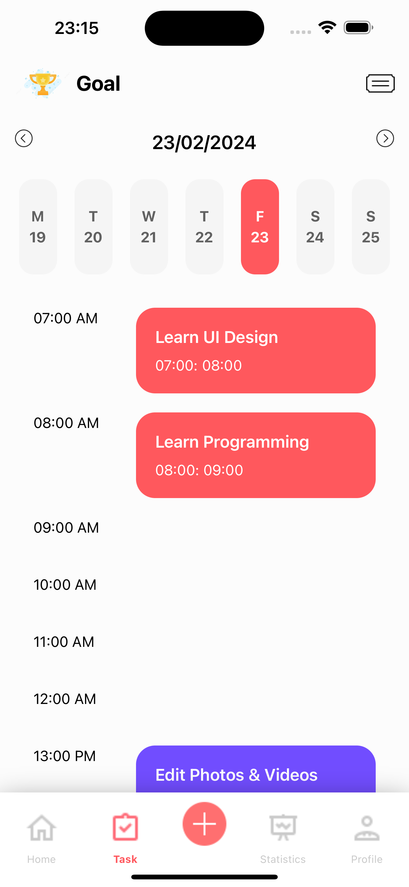

<div align="center" border>
    
</div>

# The Pomodoro Goal Source Code

This project is a [React Native](https://facebook.github.io/react-native/) app that build for beginner with React Native who want to learn more about React Native

The boilerplate provides **an optimized architecture for building solid cross-platform mobile applications** through separation of concerns between the UI and business logic. It is fully documented so that each piece of code that lands in your application can be understood and used.

```
If you love this source code, give us a star, you will be a ray of sunshine in our lives :)
```

## Requirements

Node 18 or greater is required. Development for iOS requires a Mac and Xcode 10 or up, and will target iOS 11 and up.
Cocoapods version 1.12.1

You also need to install the dependencies required by React Native.  
Go to the [React Native environment setup](https://reactnative.dev/docs/environment-setup), then select `React Native CLI Quickstart` tab.  
Follow instructions for your given `development OS` and `target OS`.

## Quick start

To learn more about the source code run this command to pull to your local machine.

```
git pull https://github.com/QuocVietHa08/pomodoro-goal.git
cd promodoro-goal
```

Assuming you have all the requirements installed, you can run the project by running:

- `yarn start` to start the metro bundler, in a dedicated terminal
- `yarn <platform>` to run the _platform_ application (remember to start a simulator or connect a device)

## Config Backend

This project use [Appwrite](https://appwrite.io/) as an alternative for backend. To config appwrite you need follow some step

- Create an account in Appwrite.
- Create a project.
- Get appwrite api endpoint and project_id in setting.
- Add to env

Image Demo:

<div style="display: flex; justify-content: center; gap: 10px; width: 100%; flex-wrap: wrap">
     
</div>

## Tech Stack

- React Native.
- Javascript.
- IOS Development.
- Android Development.
- Debugging.
- Redux / Redux Saga.
- React i18next.
- React Navigation.
- React Native Reanimated.
- Appwrite (Backend)

## Preview

<div style="display: flex; justify-content: center; gap: 10px; width: 100%; flex-wrap: wrap">
    
    
    
    
    
    
    
    
</div>

## Digging Deeper

To learn more about this source code, you should discover different screent like

- Home
- Task
- Statistic
- Profile
- Timer
- ... and more

## Contributing

This project content basic feature like view, create, update, delete task. You can add more feature:

- Real Time Chat.
- App System Blocking.
- Intergrate with Superbase/ Appwrite.
- Intergrate with Audio on Device.
- Add Unit and UI Testing.
- Convert to Typerscript version.
- Create Goal Screen Page.

# Todo

- Intergrate with SuperBase / Appwrite
